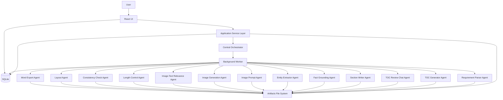
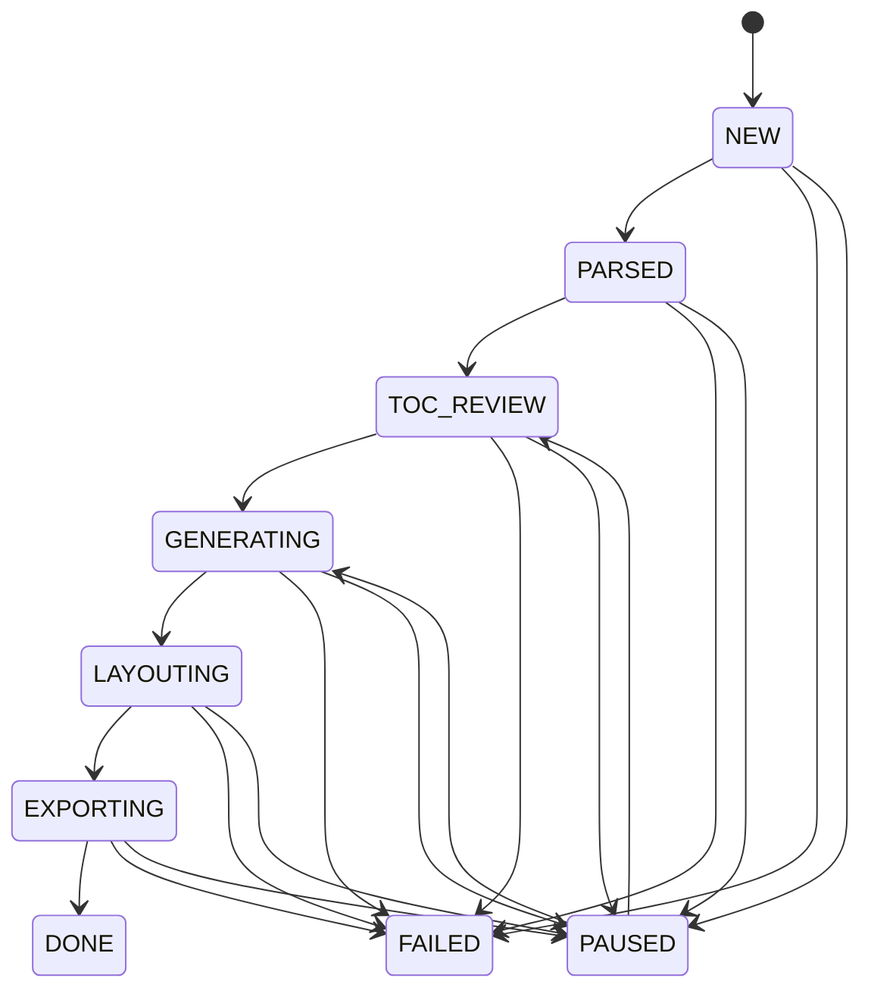
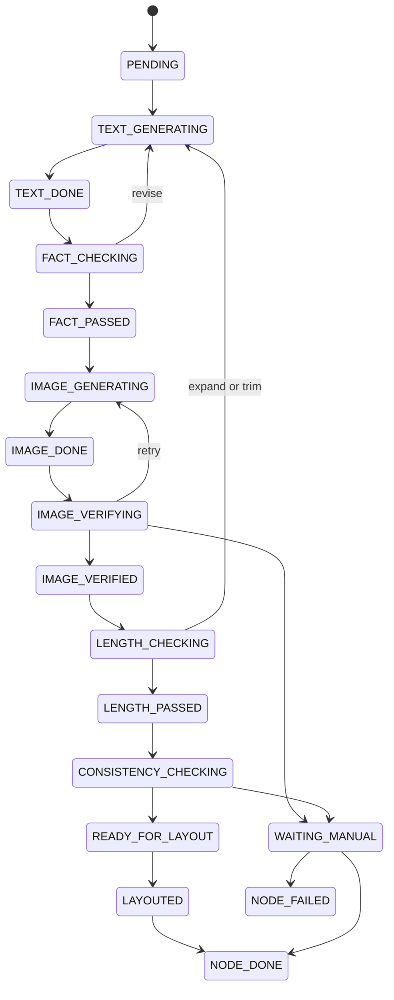
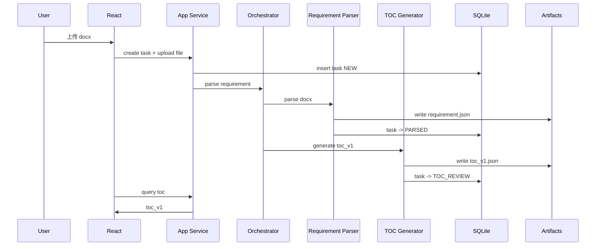
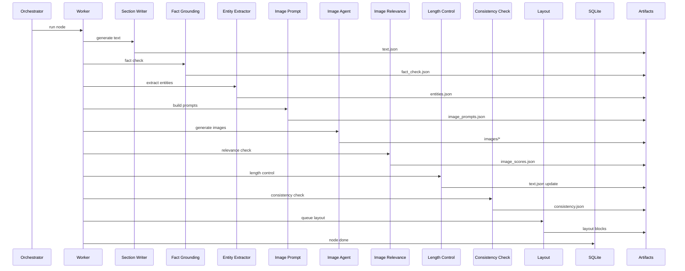

# 系统架构设计（architecture.md）

版本：V1.1  
目标：定义系统模块、调用关系、状态流转、恢复机制与技术落位

---

## 1. 总体架构

V1 采用前后端分离的轻量本地架构：

- 前端：React
- 后端编排：Python Orchestrator
- 后台执行：Worker
- 状态存储：SQLite
- 工件存储：本地文件系统
- LLM / 出图：可替换 Provider

---

## 2. 架构总览图



---

## 3. 模块职责

### 3.1 React UI
负责：
- 新建任务 / 继续任务
- 上传 `.docx`
- 展示任务状态
- 展示目录树及版本
- 展示聊天区与历史消息
- 提交目录修改意见
- 确认目录并启动生成
- 展示总进度与节点进度
- 展示实时日志
- 下载 Word 输出
- 人工处理失败节点

不负责：
- 长时间阻塞式生成
- 核心 Agent 执行逻辑

### 3.2 Application Service Layer
这是 UI 与 Worker 之间的应用层，负责：
- 创建任务
- 校验用户操作是否合法
- 写入任务状态
- 触发 orchestrator
- 查询 SQLite / artifacts
- 统一返回前端需要的数据结构

### 3.3 Central Orchestrator
负责编排流程，而不直接承担所有具体执行。

职责：
- 根据任务状态决定下一步
- 将任务拆分为阶段 / 节点子任务
- 触发后台 worker
- 维护任务级状态机
- 处理中断恢复
- 分发重试
- 统一落日志

### 3.4 Worker
真正执行节点级流程。

V1 特征：
- 单任务串行处理节点
- 节点内图片可并发
- 每阶段结束后写 checkpoint
- 发生错误后根据策略 retry / manual / fail

---

## 4. 任务级状态机



说明：
- `TOC_REVIEW` 之前不能生成正文
- 只有 `toc_confirmed` 后才能进入 `GENERATING`
- 若目录需修改且任务已进入 `GENERATING`，必须新建派生任务

---

## 5. 节点级状态机



说明：
- 这里比初版多了 `FACT_CHECKING / FACT_PASSED`
- 若图片失败，按宽松模式进入 `WAITING_MANUAL` 后仍可继续
- `WAITING_MANUAL` 不是等于失败，而是等待用户处理

---

## 6. 核心时序

### 6.1 目录生成时序



### 6.2 节点生成时序



---

## 7. 存储架构

### 7.1 SQLite 用途
SQLite 存储：
- 任务元数据
- TOC 版本元数据
- 节点状态
- 事件日志
- 聊天消息
- 运行指标
- 手动处理记录

SQLite 不存：
- Word 大文件正文全文
- 图片二进制
- 大量中间 JSON 工件正文内容

这些统一落到 artifacts。

### 7.2 文件系统用途
文件系统保存：
- 原始上传文件
- requirement.json
- toc_vN.json
- 节点中间工件
- 图片
- 最终 Word

---

## 8. 断点续跑设计

### 8.1 Checkpoint 粒度
以最小生成单元（三级或四级节点）为恢复粒度。

### 8.2 阶段结束即落盘
每个阶段结束后必须写：
- 节点当前状态
- 输入快照路径
- 输出工件路径
- 重试次数
- 指标
- 最新心跳时间

### 8.3 恢复算法
恢复时：
1. 读取任务状态
2. 读取所有节点状态
3. 找到第一个未完成节点
4. 找到该节点下一待执行阶段
5. 若上次状态是“进行中”但长时间无心跳，则回滚到上一个稳定阶段重新执行

### 8.4 心跳
Worker 执行时应定期更新：
- `last_heartbeat_at`
- `current_stage`
- `current_message`

用于判断任务是否僵死。

---

## 9. TOC 版本设计

### 9.1 为什么要树级 diff
文本 diff 只能看到文字变化，不适合树结构目录。

树级 diff 可以识别：
- 节点新增
- 节点删除
- 节点改名
- 节点移动
- 节点排序变化

### 9.2 双 ID 策略
每个节点同时保存：
- `node_uid`：语义稳定 ID，跨版本不变
- `node_id`：当前版本中的章节编号，如 `1.2.3`

好处：
- 改名不影响节点身份
- 恢复和复用更稳定
- UI 可同时展示“章节号 + 稳定引用”

---

## 10. Fact Grounding 架构位置

Fact Grounding 必须放在 Section Writer 之后、Image 相关之前。

原因：
- 先保证正文不瞎编
- 再从可信正文抽实体做出图
- 否则会把错误事实扩散到 prompt 与图片

推荐顺序：
1. text generation
2. fact grounding
3. entity extraction
4. image prompt
5. image generation
6. image relevance
7. length control
8. consistency check
9. layout

---

## 11. Layout / Export 设计

### 11.1 Layout Agent
职责：
- 读取标准模板
- 按模板样式插入标题
- 插入正文段落
- 插入表格（BiddingTable）
- 插入图片
- 处理分页
- 处理图题/组图题
- 组织节点排版块

注意：
- 禁止硬编码字体和段落样式替代模板
- 允许代码实现版式策略，但最终样式必须来自模板

### 11.2 Word Export Agent
职责：
- 将 layout blocks 组装成完整 docx
- 写出 `artifacts/{task_id}/final/output.docx`
- 记录导出耗时与结果
- 返回下载路径

---

## 12. UI 页面分区建议

### 12.1 任务区
- 新建任务
- 继续任务
- 当前任务状态
- 当前任务 ID

### 12.2 配置区
- 文本模型选择
- 图片模型选择
- API Key 配置
- 保存默认配置

### 12.3 文件上传区
- 上传 `.docx`
- 校验格式
- 显示文件名

### 12.4 目录审阅区
- 目录树折叠显示
- 版本切换
- diff 展示
- 回滚旧版本

### 12.5 AI 交互区
- 用户消息
- 系统反馈
- 开始生成目录
- 提交目录意见
- 确认目录 / 开始正文生成

### 12.6 进度区
- 总进度条
- 目录树状态着色
- 节点日志与指标查看

### 12.7 日志区
- 最近 N 条日志
- 失败原因
- 当前执行阶段

### 12.8 成果区
- 下载 output.docx
- 下载 metrics / log
- 手动确认失败节点

---

## 13. 错误处理原则

### 13.1 可自动重试
- LLM 临时失败
- 图片接口临时失败
- 图文相关性不通过
- 字数不足
- 事实支持不足（一次 revise 后可重试）

### 13.2 需人工介入
- 图片多次失败
- 事实支撑持续不足
- requirement 本身信息缺失导致无法稳定生成
- 一致性修复失败
- 模板文件损坏

### 13.3 任务失败
仅在以下场景判定任务失败：
- 模板缺失且无法恢复
- 数据库损坏
- 上传文件不可读
- 关键工件丢失且不可恢复
- 用户手动终止并放弃

---

## 14. 技术落地建议

### 14.1 包结构建议

```text
backend/
├─ app_service/
├─ orchestrator/
├─ providers/
├─ repositories/
├─ worker/
├─ agents/
├─ models/
├─ utils/
└─ config/
```

### 14.2 关键类
- `TaskService`
- `TOCService`
- `NodeService`
- `ProgressService`
- `ArtifactRepository`
- `TaskRepository`
- `NodeStateRepository`
- `EventLogRepository`
- `Orchestrator`
- `NodeRunner`

---

## 15. V1 架构原则总结

1. 先稳后快
2. 前后端职责分离
3. 节点级可恢复
4. 工件与元数据分离存储
5. 目录冻结后再生成
6. 事实校验先于出图
7. 图片失败不阻塞整任务
8. UI 必须可解释

---

## 16. 后续扩展点（V2/V3）

- 多节点并发
- 多任务队列
- 多用户
- 对象存储替代本地文件系统
- PostgreSQL 替代 SQLite
- 更强图像理解
- 自动质量评分 dashboard
- 节点级人工编辑回写
